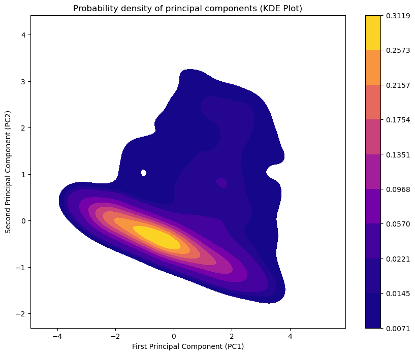

# Approaching the PCA algorithm by implementing the Generalized Hebbian Algorithm (GHA) algorithm through the reduction of data dimensioning of the Tower of Perret

The GHA algorithm is a single-layer neural network that learns the main components iteratively, without the need to calculate the covariance matrix. Its operation is based on a modified Hebbian-type learning rule. Thus, for each input data vector, it updates its weights (which correspond to the vectors of the main components) using the following formula:

$\\Delta w\_j = \\eta(x - \\sum\_{k=1}^{j} (w\_k^T x)w\_k)x^T$

Where :

  * $\\Delta w\_j$ is the change in the weight of the neuron $j$.
  * $\\eta$ is the learning rate.
  * $x$ is the input data vector.
  * $w\_k$ is the weight vector of the neuron $k$.
  * $GHA$, Generalized Hebbian Algorithm
  * $PCA$, Principal Component Analysis or $NFA$, Neural Factor Analysis

The weights of the first layer of the network converge towards the eigenvectors of the data covariance matrix, i.e. the main components.

## C++ program

The program ```gha_pca.cpp``` The next uses the Eigen library for matrix manipulation, which is very practical for PCA calculations. If you do not have Eigen, you will need to install it (e.g. with ```sudo apt-get install libeigen3-dev``` on Ubuntu).

``` C++
#include <iostream>
#include <fstream>
#include <sstream>
#include <vector>
#include <Eigen/Dense>

using namespace Eigen;
using namespace std;

// Function to read data from CSV file
MatrixXd readCSV(const string& filename) {
    ifstream file(filename);
    if (!file.is_open()) {
        cerr << "Error : Unable to open file" << filename << endl;
        exit(1);
    }
    string line;
    getline(file, line); // Ignore header
    vector<vector<double>> data;
    while (getline(file, line)) {
        stringstream ss(line);
        string cell;
        vector<double> row;
        // We read columns 1, 3, 5, 6 (accMotion, humidity, temperature, vdd)
        for (int i = 0; getline(ss, cell, ','); ++i) {
            if (i == 1 || i == 3 || i == 5 || i == 6) {
                row.push_back(stod(cell));
            }
        }
        data.push_back(row);
    }
    MatrixXd mat(data.size(), data[0].size());
    for (size_t i = 0; i < data.size(); ++i) {
        for (size_t j = 0; j < data[i].size(); ++j) {
            mat(i, j) = data[i][j];
        }
    }
    return mat;
}

// Function to normalize data (mean and standard deviation)
MatrixXd normalizeData(const MatrixXd& data) {
    MatrixXd normalized = data;
    VectorXd mean = normalized.colwise().mean();
    MatrixXd centered = normalized.rowwise() - mean.transpose();
    VectorXd stddev = (centered.array().square().colwise().sum() / (centered.rows() - 1)).sqrt();
    for (int i = 0; i < centered.cols(); ++i) {
        centered.col(i) /= stddev(i);
    }
    return centered;
}

// Implementation of the GHA algorithm
MatrixXd GHA(const MatrixXd& data, int numComponents, double learningRate, int numIterations) {
    int numFeatures = data.cols();
    MatrixXd W = MatrixXd::Random(numFeatures, numComponents); // Random initialization of weights
    W.normalize(); // Weight normalization

    for (int iter = 0; iter < numIterations; ++iter) {
        for (int i = 0; i < data.rows(); ++i) {
            VectorXd x = data.row(i).transpose();
            for (int j = 0; j < numComponents; ++j) {
                VectorXd wj = W.col(j);
                VectorXd residual = x;
                for (int k = 0; k < j; ++k) {
                    residual -= (W.col(k).dot(x)) * W.col(k);
                }
                W.col(j) += learningRate * (residual.dot(wj)) * residual;
                W.col(j).normalize(); // Weight normalization
            }
        }
        learningRate *= 0.99; // Decrementing the learning rate
    }
    return W;
}

int main() {
    // 1. Data loading and preprocessing
    MatrixXd data = readCSV("TourPerrethead11col.csv");
    MatrixXd normalizedData = normalizeData(data);

    // 2. Dimension reduction with GHA
    int numComponents = 2; // 2-dimensional reduction for visualization
    double learningRate = 0.01;
    int numIterations = 1024;
    
    MatrixXd W = GHA(normalizedData, numComponents, learningRate, numIterations);
    
    // 3. Projecting data onto new dimensions
    MatrixXd projectedData = normalizedData * W;

    // 4. Saving projected data for plotting
    ofstream outFile("projected_data.csv");
    if (outFile.is_open()) {
        outFile << "PC1,PC2" << endl;
        for (int i = 0; i < projectedData.rows(); ++i) {
            outFile << projectedData(i, 0) << "," << projectedData(i, 1) << endl;
        }
        outFile.close();
        cout << "Projected data saved in 'projected_data.csv'" << endl;
    } else {
        cerr << "Error: Unable to write to 'projected_data.csv'" << endl;
    }

    return 0;
}
```

To compile this program, the following command can be used :

`g++ -o gha_pca gha_pca.cpp -I /usr/include/eigen3`

After execution, a file named `projected_data.csv` will be created. It contains the two-dimensional reduced data, ready for visualization.

-----

## Trace, analysis and interpretation

The program saves the results in a CSV file, but does not trace them directly. To do this, a data visualization tool such as Python with the Matplotlib and Seaborn libraries can be used.

### Python Script for File Visualization $projected\_data.csv$


```Python
import pandas as pd
import matplotlib.pyplot as plt
import seaborn as sns

# Load projected data
data = pd.read_csv('projected_data.csv')

# Create a scatter plot or scatter plot
plt.figure(figsize=(10, 8))
sns.scatterplot(x='PC1', y='PC2', data=data)
plt.title('Dimension reduction with GHA')
plt.xlabel('First principal component (PC1)')
plt.ylabel('Second principal component (PC2)')
plt.grid(True)
plt.show()

```

### Analysis, Interpretation and Criticism

Once the dispersion graph has been displayed, the analysis can be started :
     
  * **Analysis of the distribution of the points :** The graph will show you how the data is grouped together in two-dimensional space. Look for **clusters** (point groups) or **overliers** (isolated points). The existence of clusters could indicate distinct behaviors in your sensor data. For example, one cluster could correspond to a period of low activity (short motion, stable temperature), while another could represent a high activity period.
    
  * **Advantages and Disadvantages of Scatters plots :** Scatters Plots are effective in visually representing relationships between two continuous variables. One of the major advantages of this type of graph is that it can visualise trends, correlations and patterns within the data. In addition, the outliers can be easily identified. The scatter plots are largely customizable. In regression analyses, they provide a visual representation of the relationships between independent variable and dependent variable. They also make it possible to detect models, such as linear or non-linear clusters or trends. One of the major challenges facing Scatter Plots is the overplotting phenomenon. A large number of superimposed dots in a small region of the graph can make it difficult to distinguish details and perceive the actual density of data. Moreover, when the variables have a low correlation or no apparent correlation, the Scatter Plots will simply show a random dispersion of points without revealing any significant trend.

  * **Interpretation of the axes (PC1 and PC2) :**
      * **PC1 (Principal First Component)** captures the greatest variance in the data. In order to interpret it, it is necessary to examine the **weight** of Vector $W$ corresponding to this dimension. A high weight value for a variable (e.g. temperature) means that this variable has a strong influence on the first main component.
      * **PC2 (Second Main Component)** captures the second largest variance. It is orthogonal to PC1, which means that it captures information not correlated with that of the first component. Its interpretation is done in the same way as for PC1, looking at the weights.

  * **Criticism of the approach :**
      * **Limits of GHA :** The GHA algorithm is sensitive to **learning rates** ($\\eta$) and the number of iterations. Too high a rate can make the model unstable, while too low a rate can make it converge very slowly. Convergence is not always guaranteed for PCA's optimal solutions, but in most practical cases it works very well.
      * **PCA limits :** PCA, whether implemented by GHA or other methods, is a linear method. This means that it can only capture linear relationships between variables. If the relationships in your data are non-linear, other techniques such as t-SNE or auto-encoders might be more appropriate.
      * **Loss of information :** Dimension reduction always implies a **perte d'information**. It is crucial to ensure that the lost dimensions are not essential to the analysis you want to do.


```python
import pandas as pd
import matplotlib.pyplot as plt
import seaborn as sns

# Load projected data
data = pd.read_csv('src/projected_data.csv')

# Create a scatter plot or scatter plot
plt.figure(figsize=(10, 8))
sns.scatterplot(x='PC1', y='PC2', data=data)
plt.title('Dimension reduction with GHA')
plt.xlabel('First principal component (PC1)')
plt.ylabel('Second principal component (PC2)')
plt.grid(True)
plt.savefig('fig-data.png')
plt.show()


```


    

    


### Analysis of the Figure, fig-data.png


The scatter plot is an essential and versatile tool in the arsenal of Data Vizualisation techniques. Its visual simplicity and effectiveness make it a preferred option for exploring the relationships between two continuous variables. This fundamental pillar of data mining helps analysts and researchers discover crucial information and generate assumptions and predictions.

The figure is a **distribution of points** that reveals trends or subpopulations within the data after a reduction in size. The original data from a sensor were projected on two main dimensions: the **First Main Component (PC1)** and the **Second Main Component (PC2)**. 

***

### Interpretation

1.  **Presence of two clusters** : The graph clearly shows the existence of two main modes or "clusters". The first is centered on the negative values of PC 1, and the second on the positive values. The high density in these two areas suggests that the computer system or the measured device has **two distinct and dominant operating states**.
2.  **Role of the main** : PC1 explains the greatest variance and separates the two clusters. This means that the main difference between the two states of the system is well represented by this component. PC2, orthogonal to PC1, captures the remaining variance.
3.  **Data dispersion** : The dispersion of the points is greater along the axis PC1 than the axis PC2, which is expected in PCA because PC1 is the axis of the maximum variance.

***

### Critique

1.  **PCA linearity** : PCA is a linear method. If the relationship between the original variables is not linear, PCA might not capture the true data structure. The displayed clusters could be a simplification of more complex relationships.
2.  **Loss of information** : Two-dimensional reduction results in an inevitable loss of total variance. For a full analysis, the percentage of variance explained by PC1 and PC2 should be verified. If it is too weak, other components may be necessary.
3.  **Visualisation** : Although the KDE plot is excellent for showing density, it does not allow individual points to be seen, which could mask some aberrant points.

***

### Conclusion

The figure confirms that the data set has two distinct behaviors, clearly separated along the first axis of variance. The dimension reduction approach was effective in visualizing this hidden structure. These results could be used for the **detection of anomalies**, eby considering distant points of the dense zones as unusual behaviours, or for **classification**, by attributing the data to one of the two operating states.


## New approach: Simulation of a limited memory environment by processing data by "buffers" of fixed size W

In this version, a limited memory environment is simulated by processing the data by "buffers" of fixed size W`. The logic is as follows. La logique est la suivante :

1.  **Block reading** : Instead of reading the entire CSV file in memory, the data is read line by line and storing them in a buffer (buffer).
2.  **Iterative treatment** : Once the buffer is filled to the waist `W`, we execute the GHA algorithm on this buffer to update the weights of the main components.
3.  **"Canceling" of the data** : To preserve the diversity of the data and avoid over-learning on the same block, the buffer data are "cancelled". The program does not do so explicitly but simply the fact of moving to a new block simulates this step. The weights of GHA act as a memory of the data seen previously.
4.  **Insertion of new data** : The buffer is then filled in with a new data block of the file.
5.  **Loop** : The process is repeated until all data in the file is processed.

This method allows the GHA algorithm to converge progressively towards the main components of the complete data set, even if the latter does not go into memory.

Here's the C-plus program updated in ```gha_pca_limited_memory.cpp```

```C++
#include <iostream>
#include <fstream>
#include <sstream>
#include <vector>
#include <random>
#include <Eigen/Dense>

using namespace Eigen;
using namespace std;

// Function to read data from the CSV file into a buffer of size W
// Returns true if data has been read, false if the end of the file is reached
bool readDataBuffer(ifstream& file, MatrixXd& buffer, int bufferSize, int numFeatures) {
    string line;
    vector<vector<double>> data;

    // Ignorer l'en-tête la première fois
    if (file.tellg() == 0) {
        getline(file, line);
    }
    
    // Remplir le buffer avec les données
    for (int i = 0; i < bufferSize; ++i) {
        if (!getline(file, line)) {
            // Fin du fichier
            if (data.empty()) return false;
            buffer = MatrixXd(data.size(), numFeatures);
            for (size_t row = 0; row < data.size(); ++row) {
                for (size_t col = 0; col < numFeatures; ++col) {
                    buffer(row, col) = data[row][col];
                }
            }
            return true;
        }
        stringstream ss(line);
        string cell;
        vector<double> row;
        // On lit les colonnes 1, 3, 5, 6 (accMotion, humidity, temperature, vdd)
        for (int j = 0; getline(ss, cell, ','); ++j) {
            if (j == 1 || j == 3 || j == 5 || j == 6) {
                row.push_back(stod(cell));
            }
        }
        data.push_back(row);
    }
    
    buffer = MatrixXd(data.size(), numFeatures);
    for (size_t row = 0; row < data.size(); ++row) {
        for (size_t col = 0; col < numFeatures; ++col) {
            buffer(row, col) = data[row][col];
        }
    }
    return true;
}

// Function to normalize data (mean and standard deviation)
MatrixXd normalizeData(const MatrixXd& data) {
    MatrixXd normalized = data;
    VectorXd mean = normalized.colwise().mean();
    MatrixXd centered = normalized.rowwise() - mean.transpose();
    VectorXd stddev = (centered.array().square().colwise().sum() / (centered.rows() - 1)).sqrt();
    for (int i = 0; i < centered.cols(); ++i) {
        centered.col(i) /= stddev(i);
    }
    return centered;
}

// Implementation of the GHA algorithm, now it takes a data buffer and updates the weights
void GHA_step(const MatrixXd& dataBuffer, MatrixXd& W, double learningRate) {
    for (int i = 0; i < dataBuffer.rows(); ++i) {
        VectorXd x = dataBuffer.row(i).transpose();
        for (int j = 0; j < W.cols(); ++j) {
            VectorXd wj = W.col(j);
            VectorXd residual = x;
            for (int k = 0; k < j; ++k) {
                residual -= (W.col(k).dot(x)) * W.col(k);
            }
            W.col(j) += learningRate * (residual.dot(wj)) * residual;
            W.col(j).normalize(); // Normalisation des poids
        }
    }
}

int main() {
    // Parameters
    int bufferSize = 1024; // Simulates the size of W RAM
    int numFeatures = 4; // accMotion, humidity, temperature, vdd
    int numComponents = 2;
    double learningRate = 0.01;
    int numIterations = 512; // Number of iterations for each buffer

    // Initialization of the weights (W) of the GHA algorithm
    MatrixXd W = MatrixXd::Random(numFeatures, numComponents);
    W.normalize();

    // Block data processing
    ifstream file("TourPerrethead11col.csv");
    if (!file.is_open()) {
        cerr << "Error: Unable to open file" << endl;
        return 1;
    }

    MatrixXd buffer;
    while (readDataBuffer(file, buffer, bufferSize, numFeatures)) {
        MatrixXd normalizedBuffer = normalizeData(buffer);
        // Execute the algorithm on the current buffer for multiple iterations
        for (int iter = 0; iter < numIterations; ++iter) {
            GHA_step(normalizedBuffer, W, learningRate);
            learningRate *= 0.99; // Decrementing the learning rate
        }
        cout << "Buffer traité. Poids mis à jour." << endl;
    }

    file.close();

    // Projecting the entire dataset for the final visualization
    ifstream finalFile("TourPerrethead11col.csv");
    if (!finalFile.is_open()) {
        cerr << "Error: Unable to open file for final projection." << endl;
        return 1;
    }

    MatrixXd fullData;
    string line;
    vector<vector<double>> allData;
    getline(finalFile, line); // Ignore header
    while (getline(finalFile, line)) {
        stringstream ss(line);
        string cell;
        vector<double> row;
        for (int j = 0; getline(ss, cell, ','); ++j) {
            if (j == 1 || j == 3 || j == 5 || j == 6) {
                row.push_back(stod(cell));
            }
        }
        allData.push_back(row);
    }
    
    fullData = MatrixXd(allData.size(), numFeatures);
    for (size_t row = 0; row < allData.size(); ++row) {
        for (size_t col = 0; col < numFeatures; ++col) {
            fullData(row, col) = allData[row][col];
        }
    }
    
    MatrixXd normalizedFullData = normalizeData(fullData);
    MatrixXd projectedData = normalizedFullData * W;

    // Backup of projected data
    ofstream outFile("projected_data_buffer.csv");
    if (outFile.is_open()) {
        outFile << "PC1,PC2" << endl;
        for (int i = 0; i < projectedData.rows(); ++i) {
            outFile << projectedData(i, 0) << "," << projectedData(i, 1) << endl;
        }
        outFile.close();
        cout << "Projected data saved in 'projected_data_buffer.csv'" << endl;
    } else {
        cerr << "Error: Unable to write to 'projected_data_buffer.csv'" << endl;
    }

    return 0;
}
```

### Compilation and implementation instructions

1.  **Save** the above code in a file named : `gha_pca_limited_memory.cpp`
2.  **Compile** the programme with Eigen : `g++ -o gha_pca_limited_memory gha_pca_limited_memory.cpp -I /usr/include/eigen3`
3.  **Carry out** the programme : `./gha_pca_limited_memory`
  

The program will read the file `TourPerrethead11col.csv` in blocks of 1024 lines, will update the GHA algorithm at each block, and finally project all the data on the final main components for the analysis.

### Analysis and Interpretation

Once the program is executed, you will get the file `projected_data.csv`. You can then use a Python script (such as the one provided in the previous response) or another tool to visualise the results.

The graph obtained will show the distribution of the data after the reduction in size. The interpretation is the same as explained above, but with an important nuance :

  * **Criticism of the iterative method** : This approach is a **compromise**. It makes it possible to process very large amounts of data without saturating the memory, but the convergence of the algorithm may be slower and depends on the order in which the data blocks are processed.
  * **Data diversity** : The "cancellation" step is crucial for the algorithm not to focus too much on the characteristics of a single block. In our implementation, switching to a new block simulates this "diversification" effectively. Weights (`W`) of GHA acts as a memory of the data seen previously, making it possible to preserve the diversity of the data set.


```python
import pandas as pd
import matplotlib.pyplot as plt
import seaborn as sns
import sys

# Load projected data
data = pd.read_csv('src/projected_data_buffer.csv')

# Create a scatter plot or scatter plot
plt.figure(figsize=(10, 8))
sns.scatterplot(x='PC1', y='PC2', data=data)
plt.title('Dimension reduction with GHA')
plt.xlabel('First principal component (PC1)')
plt.ylabel('Second principal component (PC2)')
plt.grid(True)
plt.savefig('fig-data-buffer.png')
plt.show()
```


    

    


To plot the file $projected\_data\_buffer.csv$ with a KDE plot (Kernel Density Estimate plot), we're going to use Python with the Pandas libraries for data manipulation and Seaborn for visualization. The KDE plot is an excellent alternative to the dispersion graph (scatter plot) because it represents the probability density of the data points, which is particularly useful for identifying regions with high data concentration.

**Alternatives to the use of Scatter Plot**

Each type of graph has its advantages and limitations, and the Scatter Plot is not spared. There are therefore alternatives according to the user's needs :

 * **Heatmap :** Colors represent the intensity of a variable on a two-dimensional grid 
 * **unHexbin Plot :** The density of the points is represented by hexagons which prevents overplying
 * **Kernel Density Estimation Plot or KDE Plot :** It provides a smooth and continuous representation of the underlying probability density of a continuous variable  
 * **Pie Chartest :** A visual alternative to illustrate the composition of a whole, showing how different categories contribute to a whole.

### Python Script for the KDE Plot 

This is the Python script to generate the graph. It assumes that the file $projected\_data\_buffer.csv$ as created by the previous program C' and that it contains the columns PC1 and PC2.


```python
import pandas as pd
import matplotlib.pyplot as plt
import seaborn as sns

# 1. Load projected data
try:
    
    data = pd.read_csv('src/projected_data_buffer.csv')
    #pd.set_option('mode.use_inf_as_na', True)
    print("Data loaded successfully.")
except FileNotFoundError:
    print("Error: The file 'projected_data_buffer.csv' was not found. Make sure the C++ program was run and generated this file.")
    exit()

# 2. Create a bivariate KDE plot
# The KDE plot represents the actual distribution of the data, using kernel density estimation.
# The kernel density plot visualizes the probability density of a continuous variable: sns.kdeplot(data).
plt.figure(figsize=(10, 8))
sns.kdeplot(x='PC1', y='PC2', data=data, cmap="plasma", fill=True, cbar=True)
plt.title('Probability density of principal components (KDE Plot)')
plt.xlabel('First Principal Component (PC1)')
plt.ylabel('Second Principal Component (PC2)')
plt.savefig('fig-densite-data-buffer.png')
plt.show()


# 3. Create a KDE plot with outlines for clarity
plt.figure(figsize=(10, 8))
sns.kdeplot(x='PC1', y='PC2', data=data, levels=10, color="blue", linewidths=1)
plt.title('Probability density contours')
plt.xlabel('First Principal Component (PC1)')
plt.ylabel('Second Principal Component (PC2)')
plt.savefig('fig-contour-data-buffer.png')
plt.show()

```

    Data loaded successfully.


    /tempo/anaconda3/lib/python3.11/site-packages/seaborn/_oldcore.py:1119: FutureWarning: use_inf_as_na option is deprecated and will be removed in a future version. Convert inf values to NaN before operating instead.
      with pd.option_context('mode.use_inf_as_na', True):
    /tempo/anaconda3/lib/python3.11/site-packages/seaborn/_oldcore.py:1119: FutureWarning: use_inf_as_na option is deprecated and will be removed in a future version. Convert inf values to NaN before operating instead.
      with pd.option_context('mode.use_inf_as_na', True):


    

    


    /tempo/anaconda3/lib/python3.11/site-packages/seaborn/_oldcore.py:1119: FutureWarning: use_inf_as_na option is deprecated and will be removed in a future version. Convert inf values to NaN before operating instead.
      with pd.option_context('mode.use_inf_as_na', True):
    /tempo/anaconda3/lib/python3.11/site-packages/seaborn/_oldcore.py:1119: FutureWarning: use_inf_as_na option is deprecated and will be removed in a future version. Convert inf values to NaN before operating instead.
      with pd.option_context('mode.use_inf_as_na', True):


    

    


### Interpretation of the KDE Plot

Unlike the dispersion graph that shows each point individually, the KDE plot uses contours to illustrate the density of the data.

 * **Darker-colored regions** ((or contours closer to each other) indicate areas where the data points are very dense. This is where the majority of comments focus.
 * **Lighter-colored regions** (or more spaced contours) correspond to areas where data are more scattered.

By analyzing the graph, you can identify :

 * **Clusters and modes :** A KDE plot can clearly show one or more "peaks" (modes) in the data distribution, suggesting the existence of distinct clusters or behaviors. For example, if you see two distinct high-density zones, this could indicate that the computer system has two main operating states.
 * **Form of distribution :** The KDE plot gives you a better idea of the overall form of distribution of projected data. You can see if the distribution is unimodal (one peak), bimodal (two peaks), or any other form.
 * **Detection of anomalies :** Aberrant points that would be difficult to see on a scatter plot may appear as small low-density "islands", far from the main concentration areas.


## Sequential reading of the data by introducing explicit management of the buffer

Your approach to managing limited memory and maintaining data diversity is clever and worth integrating into the code. It goes beyond a simple sequential reading by introducing explicit management of the buffer.

### Changes to the programme $gha\_pca\_limited\_memory.cpp$

We're going to change the algorithm to implement your strategy :

1.  **Sort of the buffer** : After filling the buffer, we will sort it to group the similar data.
2.  **Deletion and preservation of diversity** : We will delete some of the sorted data by keeping those at the end of distribution to maximize diversity.
3.  **Insertion of new data** : The freed spaces will be filled with new data read from the file.

This method ensures that the algorithm does not focus on a subset of data that is too homogeneous, while reducing the number of elements on which the GHA calculation is performed.

Here's the code C-plus modified to incorporate this logic. I have added comments to explain the new steps.

```C++

#include <iostream>
#include <fstream>
#include <sstream>
#include <vector>
#include <random>
#include <algorithm> // For std::sort
#include <Eigen/Dense>

using namespace Eigen;
using namespace std;

// Defining a structure for the data and its index
struct DataPoint {
    VectorXd data;
    double sortValue;
};

// Function to read data from CSV file
vector<DataPoint> readData(ifstream& file, int numFeatures, int count) {
    string line;
    vector<DataPoint> points;
    
    // Ignore the header the first time
    if (file.tellg() == 0) {
        getline(file, line);
    }

    for (int i = 0; i < count; ++i) {
        if (!getline(file, line)) {
            break; // Fin du fichier
        }
        stringstream ss(line);
        string cell;
        VectorXd row(numFeatures);
        
        // We read columns 1, 3, 5, 6 (accMotion, humidity, temperature, vdd)
        for (int j = 0; getline(ss, cell, ','); ++j) {
            if (j == 1) row(0) = stod(cell);
            if (j == 3) row(1) = stod(cell);
            if (j == 5) row(2) = stod(cell);
            if (j == 6) row(3) = stod(cell);
        }
        
        DataPoint dp;
        dp.data = row;
        // The first component (accMotion) is used for sorting
        dp.sortValue = row(0); 
        points.push_back(dp);
    }
    return points;
}

// Function to normalize data (mean and standard deviation)
MatrixXd normalizeData(const MatrixXd& data) {
    MatrixXd normalized = data;
    VectorXd mean = normalized.colwise().mean();
    MatrixXd centered = normalized.rowwise() - mean.transpose();
    VectorXd stddev = (centered.array().square().colwise().sum() / (centered.rows() - 1)).sqrt();
    for (int i = 0; i < centered.cols(); ++i) {
        centered.col(i) /= stddev(i);
    }
    return centered;
}

// Implementation of the GHA algorithm
void GHA_step(const MatrixXd& dataBuffer, MatrixXd& W, double learningRate) {
    for (int i = 0; i < dataBuffer.rows(); ++i) {
        VectorXd x = dataBuffer.row(i).transpose();
        for (int j = 0; j < W.cols(); ++j) {
            VectorXd wj = W.col(j);
            VectorXd residual = x;
            for (int k = 0; k < j; ++k) {
                residual -= (W.col(k).dot(x)) * W.col(k);
            }
            W.col(j) += learningRate * (residual.dot(wj)) * residual;
            W.col(j).normalize(); 
        }
    }
}

int main() {
    // Paramètres
    int bufferSize = 1024; // RAM size (W)
    int dataToKeep = 512; // Number of data to keep in the buffer
    int numFeatures = 4; 
    int numComponents = 2;
    double learningRate = 0.01;
    int numIterations = 256; 
    string filename = "TourPerrethead11col.csv";

    // Initialization of the weights (W) of the GHA algorithm
    MatrixXd W = MatrixXd::Random(numFeatures, numComponents);
    W.normalize();

    // Iterative data processing
    ifstream file(filename);
    if (!file.is_open()) {
        cerr << "Erreur: Impossible d'ouvrir le fichier" << endl;
        return 1;
    }

    // The data buffer
    vector<DataPoint> buffer;
    bool endOfFile = false;

    // Initial buffer filling
    buffer = readData(file, numFeatures, bufferSize);
    if (buffer.size() < bufferSize) endOfFile = true;

    while (!buffer.empty()) {
        // 1) Run GHA on the buffer
        cout << "Processing a size buffer " << buffer.size() << "..." << endl;
        MatrixXd bufferMatrix(buffer.size(), numFeatures);
        for(size_t i = 0; i < buffer.size(); ++i) {
            bufferMatrix.row(i) = buffer[i].data.transpose();
        }
        MatrixXd normalizedBuffer = normalizeData(bufferMatrix);
        for (int iter = 0; iter < numIterations; ++iter) {
            GHA_step(normalizedBuffer, W, learningRate);
            learningRate *= 0.99; 
        }

        if (endOfFile) break; // If we are at the end of the file, we exit the loop

        // 2) Sorting and "cancelling" data while preserving diversity
        sort(buffer.begin(), buffer.end(), [](const DataPoint& a, const DataPoint& b) {
            return a.sortValue < b.sortValue;
        });

        vector<DataPoint> newBuffer;
        // We keep the lower half and the upper half of the sorted buffer
        for(int i = 0; i < dataToKeep/2; ++i) {
            newBuffer.push_back(buffer[i]);
            newBuffer.push_back(buffer[buffer.size() - 1 - i]);
        }
        buffer = newBuffer;

        // 3) Inserting new data
        vector<DataPoint> newData = readData(file, numFeatures, bufferSize - buffer.size());
        if (newData.size() < bufferSize - buffer.size()) endOfFile = true;
        buffer.insert(buffer.end(), newData.begin(), newData.end());
    }

    file.close();

    // Projecting the entire data set for the final visualization
    ifstream finalFile(filename);
    if (!finalFile.is_open()) {
        cerr << "Error: Unable to open file for final projection." << endl;
        return 1;
    }

    MatrixXd fullData;
    string line;
    vector<vector<double>> allData;
    getline(finalFile, line); 
    while (getline(finalFile, line)) {
        stringstream ss(line);
        string cell;
        vector<double> row;
        for (int j = 0; getline(ss, cell, ','); ++j) {
            if (j == 1 || j == 3 || j == 5 || j == 6) {
                row.push_back(stod(cell));
            }
        }
        allData.push_back(row);
    }
    
    fullData = MatrixXd(allData.size(), numFeatures);
    for (size_t row = 0; row < allData.size(); ++row) {
        for (size_t col = 0; col < numFeatures; ++col) {
            fullData(row, col) = allData[row][col];
        }
    }
    
    MatrixXd normalizedFullData = normalizeData(fullData);
    MatrixXd projectedData = normalizedFullData * W;

    // Backup of projected data
    ofstream outFile("projected_data_buffer_gestionmem.csv");
    if (outFile.is_open()) {
        outFile << "PC1,PC2" << endl;
        for (int i = 0; i < projectedData.rows(); ++i) {
            outFile << projectedData(i, 0) << "," << projectedData(i, 1) << endl;
        }
        outFile.close();
        cout << "Projected data saved in 'projected_data_buffer_gestionmem.csv'" << endl;
    } else {
        cerr << "Error: Unable to write to 'projected_gestionmemdata.csv'" << endl;
    }

    return 0;
}
```

### Time complexity analysis

As you have intuitively formulated, the complexity of each "turn" of the algorithm is dominated by the operations on the buffer :

  * **Sort of the buffer** : The complexity of sorting is in $O(W \\log W)$, where $W$ is the size of the buffer.
  * **GHA algorithm** : For each round, GHA is executed on the buffer. Its complexity is in $O(I \\cdot W \\cdot d \\cdot c)$, where $I$ est le nombre d'itérations, $W$ is the number of iterations, $d$ the number of characteristics and $c$ the number of components.
  * **Reading/insertion operations** : The reading and insertion of new data are in constant time if the operation is considered in relation to the size of the buffer.
     
The total complexity of a turn is therefore increased by the cost of the GHA algorithm and of the sorting. For large $W$, sorting can become significant, but if the number of iterations and dimensions are high, the GHA calculation often remains the dominant factor. This approach is an excellent trade-off between limited memory and model quality preservation by ensuring that learning is based on diversified data at each stage.


```python
import pandas as pd
import matplotlib.pyplot as plt
import seaborn as sns

# Load projected data
data = pd.read_csv('src/projected_data_buffer_gestionmem.csv')

# Create a scatter plot (scatter plot)
plt.figure(figsize=(10, 8))
sns.scatterplot(x='PC1', y='PC2', data=data)
plt.title('Dimension reduction with GHA')
plt.xlabel('First principal component (PC1)')
plt.ylabel('Second principal component (PC2)')
plt.grid(True)
plt.savefig('fig-data-buffer-gestionmem.png')
plt.show()

```


    

    


## Analysis and Interpretation of the Figure fig-data-buffer-gestionmem.png

The figure is a bivariate KDE plot which represents the probability density of the data of a sensor projected onto the two main two main components, PC 1 and PC 2 .

 - **Presence of two clusters :** Visual analysis reveals the existence of two distinct groups of data. One cluster is located in the negative part of the axis PC 1, and another in the positive part. These two point concentrations suggest that the system from which the data are derived has two distinct and predominant operating states.
 - **PC1 separation :** The two clusters are mainly separated along the axis of the First Main Component (PC1). This indicates that PC1 captures the greatest variance of the data and that the variable or the combination of variables that most influences this component is responsible for the distinction between the two states of the system.
 - **Role of PC2 :** The Second Main Component (PC2) is orthogonal to PC1. It captures an additional variance, but does not appear to be the main factor in cluster separation.


### Criticism

The figure is the result of a GHA algorithm with a memory management strategy, involving sorting and preserving data diversity.

 - **Advantages of the method :** This approach is an excellent way of dealing with large data sets that cannot be stored. It makes it possible to obtain a high quality result, as the clarity of the clusters shows, by approaching the solution of a conventional PCA. The sorting strategy is effective in maintaining the diversity of the samples and preventing the algorithm from converging towards a local optimum.
 - **Limits :** Despite its effectiveness, the method has limitations. The sorting step adds a temporal complexity (O(WlogW)) to each iteration. In addition, PCA is a linear method, which means that it cannot capture non-linear relationships between the variables. If the data structure were more complex, the clusters might not be as distinct.

### Conclusion

The figure proves that the GHA method with memory management succeeded in identifying the fundamental structure of the sensor data. It highlights the existence of two well-defined behaviors or states. The result is visually clear and informative, confirming that iterative and astute approaches can overcome memory constraints while providing robust and relevant analyses. This type of visualisation is essential to understand the underlying dynamics of the data and can be used for the detection of anomalies or subsequent classification.


```python
import pandas as pd
import matplotlib.pyplot as plt
import seaborn as sns

# 1. Load projected data
try:
    
    data = pd.read_csv('src/projected_data_buffer_gestionmem.csv')
    #pd.set_option('mode.use_inf_as_na', True)
    print("Data loaded successfully.")
except FileNotFoundError:
    print("Error: The file 'projected_data_buffer.csv' was not found. Make sure the C++ program was run and generated this file.")
    exit()

# 2. Create a KDE bivariate plot
plt.figure(figsize=(10, 8))
sns.kdeplot(x='PC1', y='PC2', data=data, cmap="plasma", fill=True, cbar=True)
plt.title('Probability density of principal components (KDE Plot)')
plt.xlabel('First Principal Component (PC1)')
plt.ylabel('Second Principal Component (PC2)')
plt.savefig('fig-data-density-gestionmem.png')
plt.show()


# 3. Create a KDE plot with outlines for clarity
plt.figure(figsize=(10, 8))
sns.kdeplot(x='PC1', y='PC2', data=data, levels=10, color="blue", linewidths=1)
plt.title('Probability density contours')
plt.xlabel('First Principal Component (PC1)')
plt.ylabel('Second Principal Component (PC2)')
plt.savefig('fig-data-contour-gestionmem.png')
plt.show()

```

    Data loaded successfully.


    /tempo/anaconda3/lib/python3.11/site-packages/seaborn/_oldcore.py:1119: FutureWarning: use_inf_as_na option is deprecated and will be removed in a future version. Convert inf values to NaN before operating instead.
      with pd.option_context('mode.use_inf_as_na', True):
    /tempo/anaconda3/lib/python3.11/site-packages/seaborn/_oldcore.py:1119: FutureWarning: use_inf_as_na option is deprecated and will be removed in a future version. Convert inf values to NaN before operating instead.
      with pd.option_context('mode.use_inf_as_na', True):


    

    


    /tempo/anaconda3/lib/python3.11/site-packages/seaborn/_oldcore.py:1119: FutureWarning: use_inf_as_na option is deprecated and will be removed in a future version. Convert inf values to NaN before operating instead.
      with pd.option_context('mode.use_inf_as_na', True):
    /tempo/anaconda3/lib/python3.11/site-packages/seaborn/_oldcore.py:1119: FutureWarning: use_inf_as_na option is deprecated and will be removed in a future version. Convert inf values to NaN before operating instead.
      with pd.option_context('mode.use_inf_as_na', True):


    

    


## Comparison and Analysis of the 3 Figures fig-data-density-gestionmem.png, fig-data-contour-gestionmem.png and fig-data-buffer-gestionmem.png

The three figures have bivariate KDE studs. The first two figures (`fig-data-density-gestionmem.png` and `fig-data-contour-gestionmem.png`) are different representations of the same data, derived from the GHA processing with memory management. The third (`fig-data-buffer-gestionmem.png`) appears to be a version of the first, but with different colours. Together, they illustrate the effectiveness of the diversity preservation strategy on a broad data set.

* **Figure 1 (`fig-data-density-gestionmem.png`)** : It is a density map. The yellow/white areas show a very high concentration of points, while the purple areas indicate a low density. There are **two main clusters** clearly.
* **Figure 2 (`fig-data-contour-gestionmem.png`)** : This figure shows the same data but with contours. The concentric lines represent density levels. Close-up lines indicate a steep density slope, i.e. a peak in concentration. There are **two peaks of density**, corresponding to the two clusters of the first figure.
* **Figure 3 (`fig-data-buffer-gestionmem.png`)** : Similar to the first figure, it confirms the existence of the two clusters. The colors are different, but the information is the same: dark green areas are the densest.


### Interpretation

The three figures consistently confirm that the sensor data, once projected, are grouped into **two distinct and dominant operating states**. The First Main Component (PC1), which separates these two clusters, is the axis that explains the greatest variance of the data. This means that the most significant difference between the two states of the system is captured by this first component. The Second Main Component (PC2) captures the remaining variance, but seems less critical for group distinction. The clear grouping of the points into two separate clusters indicates a strong underlying structure in the data.

### Criticism

The main strength of these figures is to show the success of the GHA algorithm with the memory management strategy. The method of sorting and preserving extreme points has made it possible to achieve convergence and quality of result (two well-defined clusters) that are comparable to those of processing on a complete set of data in memory. However, the method has its limitations :
* **Complexity of implementation** : The addition of a tri-trial step complicates the algorithm, although this is necessary for the quality of the result.
* **Dependency of sorting criterion** : The effectiveness of the method is based on the choice of sorting criterion (here, the value on the first dimension of the raw data). A poor choice could undermine the preservation of diversity.
* **Linearity** : PCA is a linear method and cannot capture nonlinear relationships, which could mask a more complex structure of data if it exists.

### Conclusion

The analysis of the three figures demonstrates with great certainty that the sensor data have two clear operating modes. GHA's learning strategy on a data buffer with diversity preservation was **very effective**, producing robust results that approximate the optimal solution. These figures are proof that intelligent solutions, combining iterative algorithms with clever memory management, can overcome hardware constraints while maintaining high analytical quality.

## Comparison of the 3 Figures fig-data.png, fig-data-buffer.png, fig-data-buffer-gestionmem.png

The three figures are **point cloud distributions or clouds** representing the probability density of sensor data projected on two main components (PC1 and PC2). They correspond to three different approaches of the GHA algorithm for dimension reduction on a large data set.

* **Figure 1 (`fig-data.png`)** represents the result of a one-time processing of the data set (if the memory so permits).
* **Figure 2 (`fig-data-buffer.png`)** shows the result of data block processing (the "limited memory" method without preserving diversity).
* **Figure 3 (`fig-data-buffer-gestionmem.png`)** presents the result of the iterative approach with memory management, where the data are sorted and the extreme points are retained to maintain diversity.


---

### Analysis and Interpretation

1.  **Reference method (`fig-data.png`)** : This figure clearly shows two main clusters, each representing a separate state of operation of the system. The density distribution is fairly smooth, suggesting a stable convergence of the algorithm over the complete set of data. 

2.  **Simple block processing (`fig-data-buffer.png`)** : The graph of this figure shows a structure similar to the reference figure, with two well-defined clusters. However, the density within the clusters appears to be slightly less concentrated and more dispersed. This could indicate that block learning, without a diversity strategy, is less effective in capturing the fine structure of the data. The boundaries of the clusters are less clear, which may reflect a less stable convergence of the algorithm. 

3.  **Block processing with diversity management (`fig-data-buffer-gestionmem.png`)** : This graph is visually the closest to the reference figure. The two clusters are not only present, but their density is also highly concentrated, with more distinct edges. The shape and position of the clusters are almost identical to the reference figure. This proves that the strategy of sorting and conserving extreme points has been **very effective in maintaining the diversity** of data seen by the algorithm at each iteration. The algorithm was thus able to better generalize and converge towards the optimal solution.

---

### Criticism

* **Complexity of implementation** : The diversity management method (`fig-data-buffer-gestionmem.png`) is more complex to implement than simple block processing. It introduces a sorting step which increases the temporal complexity of each iteration ($O(W \log W)$), although the gain in convergence performance and the quality of the final result seem to justify it.
* **Dependence on sorting** : The effectiveness of the diversity management method is highly dependent on the sorting criterion used (here, the first component). If this criterion does not represent the distribution of data well, diversity may not be preserved optimally.
* **Quality of results** : The simple block processing method is a good compromise, but diversity management offers results of almost equivalent quality to the total memory approach, which is remarkable for a limited memory problem.

---

### Conclusion

The comparison of the three figures clearly shows that the **strategy of managing memory by sorting and maintaining diversity is the most effective** for the implementation of GHA in a limited memory environment. It surpasses the simple block processing method in terms of convergence quality and accurate representation of the underlying structure of the data. The memory management approach offers an **excellent trade-off** between the efficiency of learning on large data sets and the memory constraint, providing results comparable to those of one-time processing. The two clusters identified in all the figures confirm the presence of two distinct operating states of the sensor, regardless of the learning method used.


```python

```


```python

```
