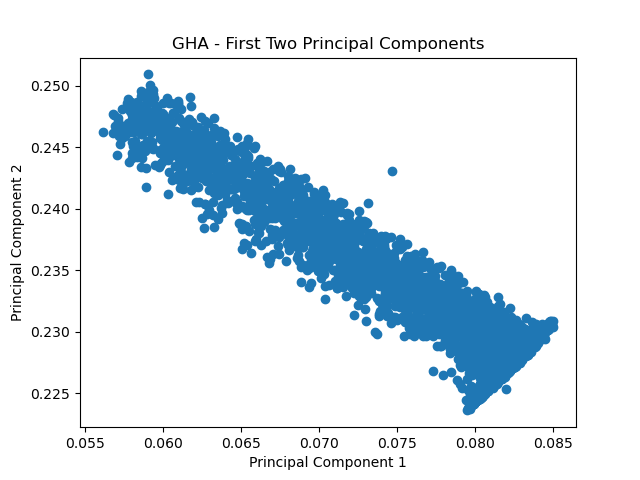
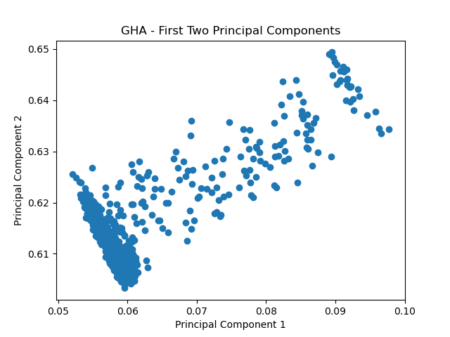
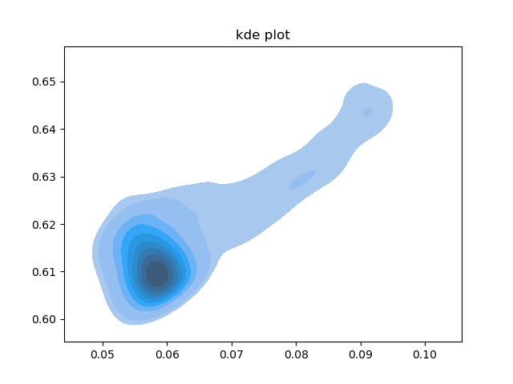

# Generalized Hebbian Algorithm (GHA) for Online Principal Component Analysis (PCA)

This repository implements the **[Generalized Hebbian Algorithm (GHA)](https://en.wikipedia.org/wiki/Generalized_Hebbian_algorithm)**, also known as **Sanger's Rule**, for performing online Principal Component Analysis (PCA). The GHA algorithm incrementally updates the principal components and eigenvalues from streaming data, allowing for an efficient, adaptive computation of PCA.

The significance of this concept is attributed to its characterization as a single-layer learning process, wherein synaptic weights are modified solely based on the interactions between the inputs and outputs of the corresponding layer. This distinct feature mitigates the complex multi-layer dependencies inherent in the backpropagation algorithm. Moreover, it presents a straightforward and foreseeable balance between the velocity of learning and the precision of convergence, which is determined by the learning rate parameter η.

## Table of Contents
- [Overview](#overview)
- [Dependencies](#dependencies)
- [Usage](#usage)
  - [Example 1](#example-1)
  - [Example 2](#example-2)
  - [Example 3](#example-3)

## Overview

Principal Component Analysis (PCA) is a dimensionality reduction technique that finds the principal components of the data. In many scenarios where data arrives incrementally, such as in real-time systems, it is important to perform PCA online. This code implements an online PCA using the GHA algorithm, which updates the eigenvalues and eigenvectors incrementally as new data points are provided.

The two main functions provided in this code are:
1. `ghapca_C`: Updates the matrix `Q` (the eigenvectors) based on the current data point `x`, the projected data point `y`, and the learning rate `gamma`.
2. `ghapca`: Performs the GHA update, calculating and updating the eigenvalues and eigenvectors of the data in an online fashion.


> ghapca in R: [Generalized Hebbian Algorithm for PCA](https://www.rdocumentation.org/packages/onlinePCA/versions/1.3.2/topics/ghapca).

> Terence D. Sanger, Optimal unsupervised learning in a single-layer linear feedforward neural network, Neural Networks, Volume 2, Issue 6, 1989, Pages 459-473, [http://dx.doi.org/10.1016/0893-6080(89)90044-0](http://dx.doi.org/10.1016/0893-6080(89)90044-0).

> Haykin, Simon (1998). Neural Networks: A Comprehensive Foundation (2 ed.). Prentice Hall. ISBN 978-0-13-273350-2.

## Dependencies

To run this code, you need to have the following Python packages installed:

- `numpy`: For efficient matrix and vector operations.
- `matplotlib`: This is used to plot the results.
- `pandas`: For data analysis and manipulation tool. (only necessary to run `testing_ghapca_json.py`).
- `scikit-learn`: For Kernel Density Estimation.

You can install these dependencies via pip (or through a [virtual environment](https://docs.python.org/3/library/venv.html)):

```bash
pip install numpy matplotlib pandas
```

## Usage

### Example 1

```bash
python3 testing_ghapca.py
```
A random dataset is generated, and then the `ghapca` algorithm is applied.

### Example 2

```bash
python3 testing_ghapca_json.py
```

First, a dataset [available online](https://github.com/CampusIoT/datasets/tree/main/TourPerret), namely the Tour Perret dataset (`tourperret.ndjson.gz`), is loaded, and then the `ghapca` algorithm is applied. We consider the following 10 attributes from Payload key:

1. accMotion: sensor vibrations. This measurement counts the number of movements of the box object containing the sensor detected by the accelerometer;
2. digital: There are no magnets on the Perret Tower sensors, so the measurement must be zero.
3. humidity: outside relative humidity;
4. pulseAbs: Relative pulse count;
5. temperature: outside temperature;
6. vdd: battery voltage in mV. It varies with ambient temperature. The battery is almost empty at around 2.9 - 2.8V;
7. waterleak: Water Leak strength or detection;
8. x: x-axis sensor orientation;
9. y: y-axis sensor orientation;
10. z: z-axis sensor orientation.

<figure>
    
    <figcaption><b>Figure 1:</b> Dimensionality Reduction on the Tour Perret Dataset.</figcaption>
</figure>

### Example 3

We simulate a computing system with limited size (W) RAM and processing with the `ghapca` algorithm. Thus, the dataset does not fit entirely in RAM. We put in place an iterative schema that 1) runs the `ghapca` algorithm on a buffer of size $W$, 2) then 'cancels' ($\sqrt{W}$) data from the buffer but keeping diversity, 3) then considers/inserts $\sqrt{W}$ fresh data into the buffer of size $W$, then returns to step 1.

Intuitively, regarding the 'cancelation' part in the `testing_batch_ghapca_json.py` implementation, we use sorting of the buffer of size $W$, then we delete objects at regular intervals. The idea is to maintain diversity in this way. In step 3), we insert fresh data at the pre-calculated 'canceled' positions. This last part is accomplished in constant time. Finally, the time complexity of one round of the algorithm is bounded by the sum of the time complexity of the `ghapca` algorithm on $W$ data and the time complexity of sorting (${\cal O} (W\log W)$ in case of a quicksort).

In the following, we set $W=1024$ and explore the previous Tour Perret dataset again. A run (`python3 testing_batch_ghapca_json.py`) sample gives two Figures:

<figure>
    
    <figcaption><b>Figure 2:</b> Dimensionality Reduction on the Tour Perret Dataset with batch ghapca.</figcaption>
</figure>

<figure>
    
    <figcaption><b>Figure 3:</b> Kernel Density Estimation.</figcaption>
</figure>

<p></p>

Let us quote [Sciki-learn](https://scikit-learn.org/1.5/modules/density.html). Mathematically, a kernel is a positive function $K(x;h)$
which is controlled by the bandwidth parameter $h$.
Given this kernel form, the density estimate at a point $y$ within
a group of points $x_i; i=1\cdots N$ is given by:
$\rho_K(y) = \sum_{i=1}^{N} K(y - x_i; h)$

The bandwidth here acts as a smoothing parameter, controlling the tradeoff
between bias and variance in the result.  A large bandwidth leads to a very
smooth (i.e. high-bias) density distribution.  A small bandwidth leads
to an unsmooth (i.e. high-variance) density distribution.

The parameter $bandwidth$ controls this smoothing. One can either set
this parameter manually or use Scott’s and Silverman's estimation
methods. Check with the [implementation](https://scikit-learn.org/1.5/modules/generated/sklearn.neighbors.KernelDensity.html#sklearn.neighbors.KernelDensity).


