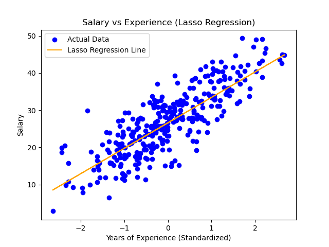
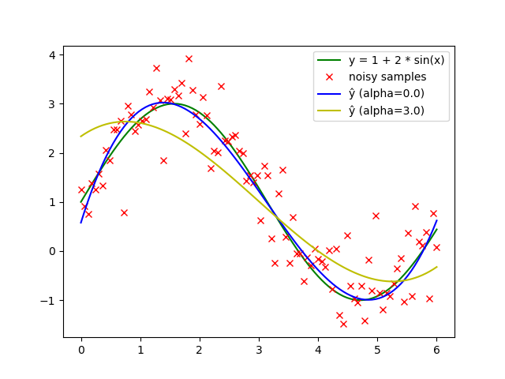
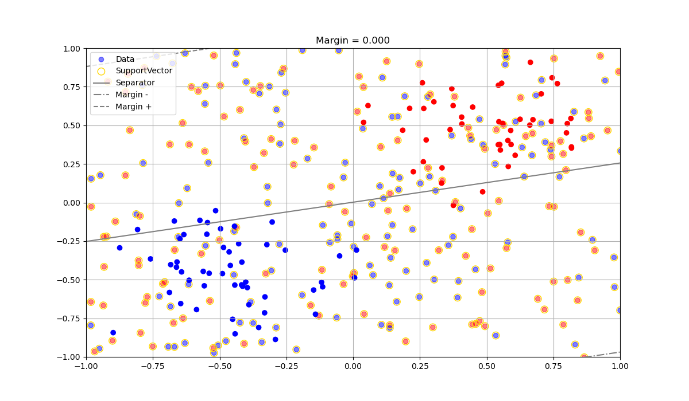
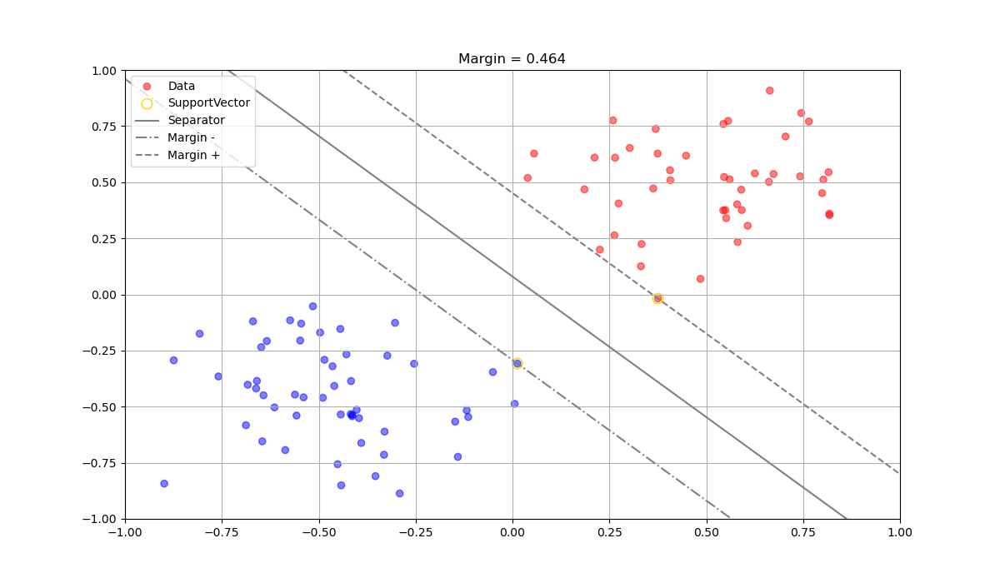
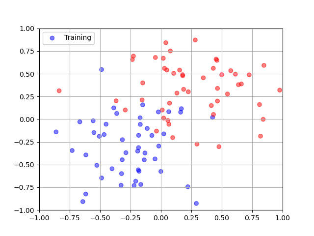
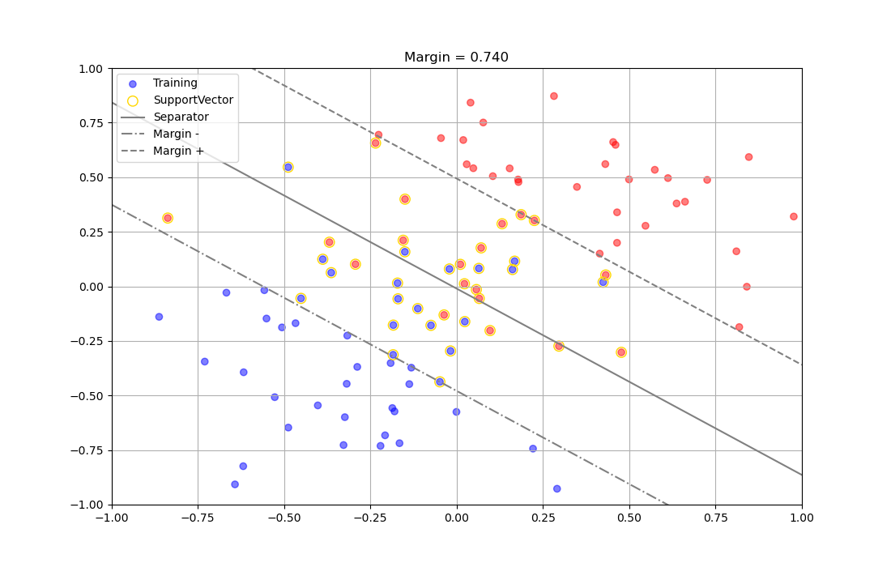
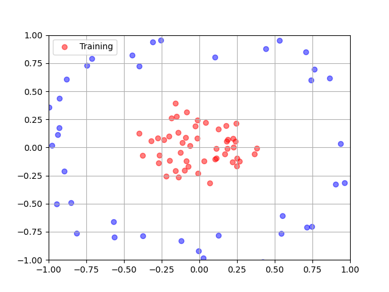
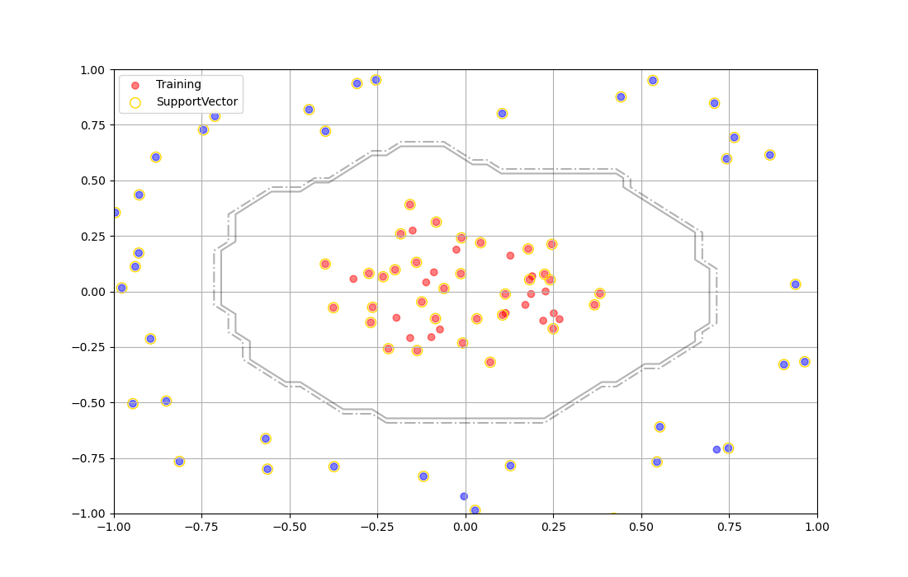
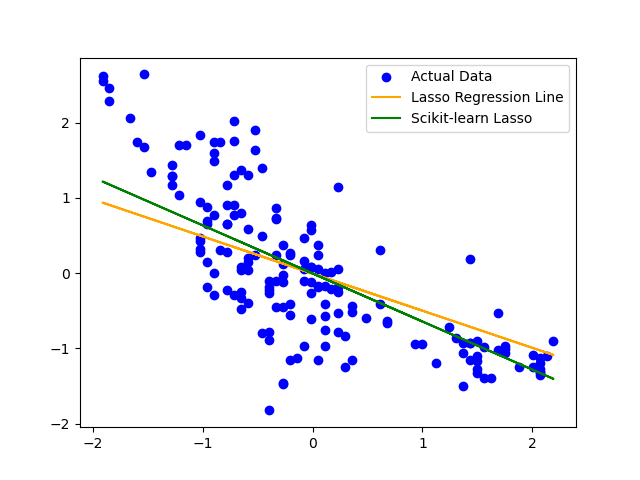
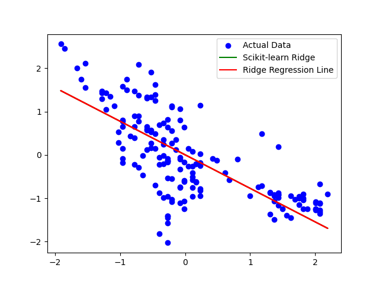

# Regression analysis

## Introduction

Within the framework of statistical modeling, regression analysis comprises a collection of statistical methodologies aimed at quantifying the relationships between a dependent variable—frequently referred to as the outcome, response variable, or, in the context of machine learning, a label—and one or more independent variables devoid of errors. These independent variables are commonly termed as regressors, predictors, covariates, explanatory variables, or features.

This page introduces the following regression methods:

- Gradient Boosting;
- Lasso (batch and online);
- Random Forest;
- Ridge (batch and online);
- SVR (Support Vector Regression)
- The file `batch_regression.py` aggregates and compiles different methods.

All the files with prefix `batch_` implement offline (or batch) regression methods, meaning the data are known in advance. Extreme-edge incremental means that data continually arrives, flows in a window/buffer of fixed size, so we need to build the regression only with the available data in the buffer.

## Offline learning and regression

<figure>
  
  <figcaption><b>Fig. 1:</b> Exploring data with LASSO method</figcaption>
</figure>

  
   

<figure>
  
  <figcaption><b>Fig. 2:</b> Exploring data with RIDGE method</figcaption>
</figure>

  
   

  The next figures correspond to outcomes of the `batch_SVR.py` Python code and illustrate different situations and configurations for the model's parameters. Please refer to the source code.

 
   

  <figure>
  
  <figcaption><b>Fig. 3:</b> Exploring dataset with SVR (1/6)</figcaption>
</figure>

 
   

  <figure>
  
  <figcaption><b>Fig. 4:</b> Exploring dataset with SVR (2/6)</figcaption>
</figure>

 
   

  <figure>
  
  <figcaption><b>Fig. 5:</b> Exploring dataset with SVR (3/6)</figcaption>
</figure>

 
   

  <figure>
  
  <figcaption><b>Fig. 6:</b> Exploring dataset with SVR (4/6)</figcaption>
</figure>

 
   

  <figure>
  
  <figcaption><b>Fig. 7:</b> Exploring dataset with SVR (5/6)</figcaption>
</figure>

 
   

  <figure>
  
  <figcaption><b>Fig. 8:</b> Exploring dataset with SVR (6/6)</figcaption>
</figure>
  
   

## Extreme-edge incremental learning and regression

According to the scenario, we consider the Tour Perret dataset from the Smart-Building sector. IoT sensors continually send data to an embedded device that is supposed to learn from the data. The device receives two types of messages: data like temperature and humidity, or a request to send back to the cloud or fog layer, the model learned from the data.

Following the implementations of `online_lasso.py` and `online_ridge.py`, the proposed methodology for extreme-edge incremental Lasso and Ridge learning proceeds as follows: Initially, humidity and temperature data are extracted from the `TourPerret.csv` file. Subsequently, a simulation of the preceding scenario is established. The input data are transferred into a buffer of size $W=512$, which is subsequently sorted. Thereafter, a loop is initiated whereby $\sqrt{W}$ values are regularly forgotten within the buffer and substituted with new values. The purpose of this procedure is to maintain diversity within the buffer by sorting it at predetermined intervals. Additionally, a simulation of receiving a message to retrieve the model is conducted through test $i == N - 2$, followed by plotting of the model built on the currently available data within the buffer.

The outcomes produced by our implementations, alongside those generated by Scikit-learn, are depicted in Figures 9 and 10. It is observed that the results from our implementations are comparable to their Scikit-learn counterparts.

   

  <figure>
  
  <figcaption><b>Fig. 9:</b> Exploring Tour Perret dataset with online Lasso</figcaption>
</figure>
  
   

  
   

  <figure>
  
  <figcaption><b>Fig. 8:</b> Exploring Tour Perret dataset with online Ridge</figcaption>
</figure>
  
   

