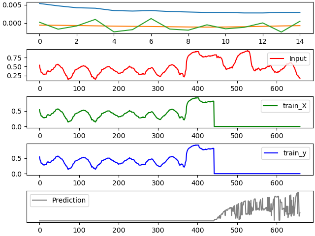
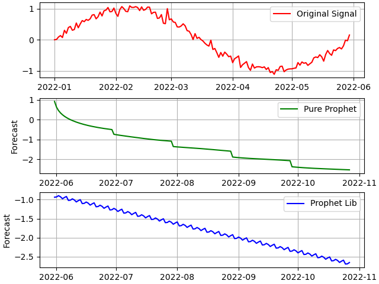

# Time series

This page relates batch and Extreme-edge incremental learning for time series analysis. The latter is based on offline / batch learning method, but considering a 'sliding window' and not the full data.

We provide experimental results, based on random generated data or real data from an outside building (`TourPerretNoHeader.csv`). The humidity attribute of the dataset corresponds to the observed data for the building. We do forecasting for this attribute.

## Batch learning and time series

You will find three types of methods: LSTM (Long short-term memory) and BI-LSTM (bidirectional long short-term memory), PROPHET, and TBATS (Trigonometric Box-Cox transform, ARMA errors, Trend, and Seasonal components). 

- Long short-term memory (LSTM)is a type of recurrent neural network (RNN) aimed at mitigating the vanishing gradient problem[2] commonly encountered by traditional RNNs.
- Prophet is a procedure for forecasting time series data based on an additive model where non-linear trends are fit with yearly, weekly, and daily seasonality, plus holiday effects. It works best with time series with strong seasonal effects and several seasons of historical data. Prophet is robust to missing data and shifts in the trend, and typically handles outliers well.
- TBATS model is a powerful method for time series forecasting that can handle multiple seasonalities and complex patterns.

Figure 1 illustrates the humidity values over 360 time intervals, represented by the plot in red. The green and blue lines indicate the training data, while the grey line represents the predictions. The Python code adheres to traditional methodologies. Once the dataset is prepared, it is imperative to partition it into training and testing subsets to assess the model's performance on data unseen during training. Subsequently, a Long Short-Term Memory (LSTM) model is employed. Upon fitting the model with the training data, predictions are generated on the test set. This approach provides insights into the model's efficacy in forecasting humidity based on novel input data.

The computational time required for processing the 360 time intervals is approximately 35 seconds when executed on a MacBook Air configured with 24MB of RAM and an M3 processor. Consequently, achieving efficient learning on a microcontroller, which possesses significantly fewer resources than the aforementioned MacBook Air, poses challenges, particularly if prompt response times are desired.

Note that the top of Figure 1 corresponds to a trial over the first 15 values of the dataset.

<figure>
  
  <figcaption><b>Fig. 1:</b> Exploring Tour Perret dataset with LSTM</figcaption>
</figure>

  
   

  
Figure 2 illustrates a periodic signal subjected to 'noise' interference. The green line, labeled 'Pure Prophet,' depicts the prediction generated by our Python implementation of the PROPHET algorithm. Conversely, the blue line, labeled 'Prophet Lib,' represents the forecast obtained using the `prophet` library within the same test dataset. While the `prophet` library offers a broader range of functionalities and demands less parameter tuning compared to our version, it is noteworthy that our implementation is fully self-contained and independent of external libraries.

  
   

<figure>
  
  <figcaption><b>Fig. 2:</b> Exploring a random generated dataset with PROPHET</figcaption>
</figure>

## Extreme-edge incremental learning and time series

In online computing, using a circular buffer with an offline algorithm is effective. For example, in a smart building, data arrives every 10 minutes (6 data points per hour). The circular buffer, with a capacity of 360, stores 60 hours of data. Every 60 hours, a forecast is sent to the cloud or fog level for the building administrator to decide on further actions.

We implemented a simulation because there is no feedback and the precision is not used. The algorithm applies a circular buffer and TBATS for forecasting, which handles data with multiple seasonal patterns. TBATS is preferred over BATS for its ability to manage complex high-frequency data due to trigonometric seasonality. TBATS stands for Trigonometric seasonality, Box-Cox transformation, ARIMA errors, Trend, and Seasonal components.

TBATS is ideal for handling seasonality. This page includes an example using Tour Perret data, showcasing the seasonality in humidity and forecasts every 360 ticks. See Figure 3. We also compare results with TBATS from the SKtime package. See after Figure 3.
 
   

<figure>
  
  <figcaption><b>Fig. 3:</b> Exploring humidity attribute of Tour Perret dataset</figcaption>
</figure>

<code>
% python3 online_TBATS_1.py
Forecast based on data between [0,360[: ['49.21', '49.21', '49.21', '49.21', '49.21']
Forecast based on SKTIME + TBATS: ['46.02', '46.02', '46.02', '46.02', '46.02']
Forecast based on data between [360,720[: ['64.93', '64.93', '64.93', '64.93', '64.93']
Forecast based on SKTIME + TBATS: ['54.93', '54.93', '54.93', '54.93', '54.93']
Forecast based on data between [720,1080[: ['50.35', '50.35', '50.35', '50.35', '50.35']
Forecast based on SKTIME + TBATS: ['70.43', '70.43', '70.43', '70.43', '70.43']
Forecast based on data between [1080,1440[: ['52.95', '52.95', '52.95', '52.95', '52.95']
Forecast based on SKTIME + TBATS: ['43.11', '43.11', '43.11', '43.11', '43.11']
Forecast based on data between [1440,1800[: ['53.30', '53.30', '53.30', '53.30', '53.30']
Forecast based on SKTIME + TBATS: ['56.02', '56.02', '56.02', '56.02', '56.02']
Forecast based on data between [1800,2160[: ['58.34', '58.34', '58.34', '58.34', '58.34']
Forecast based on SKTIME + TBATS: ['56.23', '56.23', '56.23', '56.23', '56.23']
Forecast based on data between [2160,2520[: ['55.13', '55.13', '55.13', '55.13', '55.13']
Forecast based on SKTIME + TBATS: ['47.02', '47.02', '47.02', '47.02', '47.02']
Forecast based on data between [2520,2880[: ['45.63', '45.63', '45.63', '45.63', '45.63']
Forecast based on SKTIME + TBATS: ['45.24', '45.24', '45.24', '45.24', '45.24']
Forecast based on data between [2880,3240[: ['42.32', '42.32', '42.32', '42.32', '42.32']
Forecast based on SKTIME + TBATS: ['30.16', '30.16', '30.16', '30.16', '30.16']
Forecast based on data between [3240,3600[: ['38.52', '38.52', '38.52', '38.52', '38.52']
Forecast based on SKTIME + TBATS: ['60.91', '60.91', '60.91', '60.91', '60.91']
Forecast based on data between [3600,3960[: ['73.56', '73.56', '73.56', '73.56', '73.56']
Forecast based on SKTIME + TBATS: ['68.17', '68.17', '68.17', '68.17', '68.17']
Forecast based on data between [3960,4320[: ['55.48', '55.48', '55.48', '55.48', '55.48']
Forecast based on SKTIME + TBATS: ['50.08', '50.08', '50.08', '50.08', '50.08']
Forecast based on data between [4320,4680[: ['53.83', '53.83', '53.83', '53.83', '53.83']
Forecast based on SKTIME + TBATS: ['62.21', '62.21', '62.21', '62.21', '62.21']
</code>
